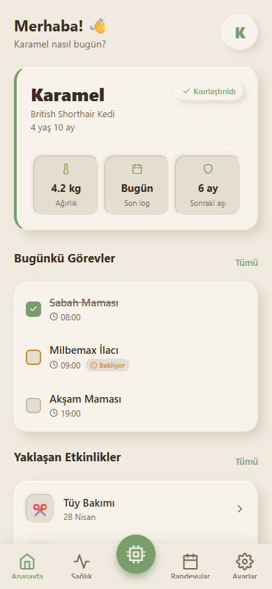
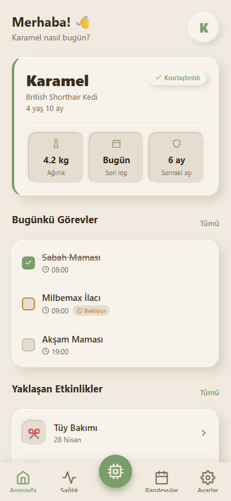
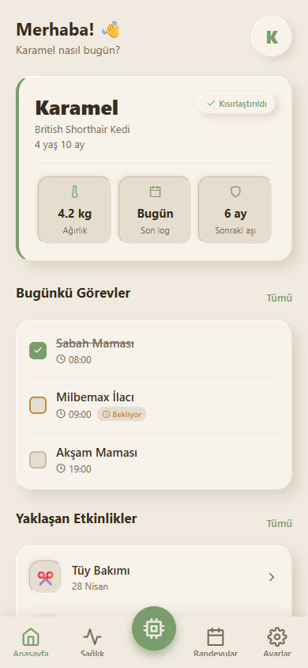
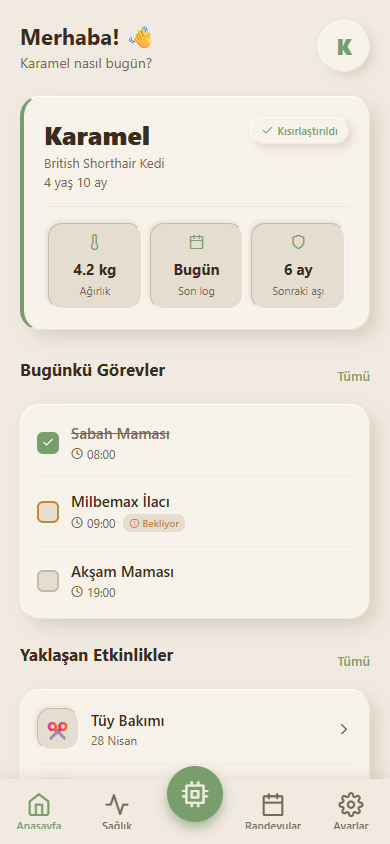
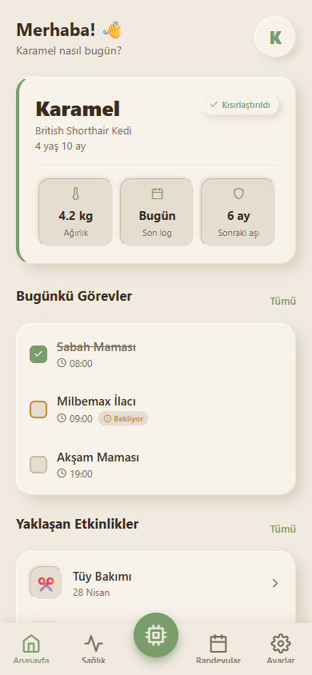
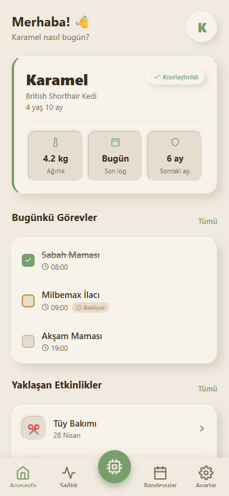
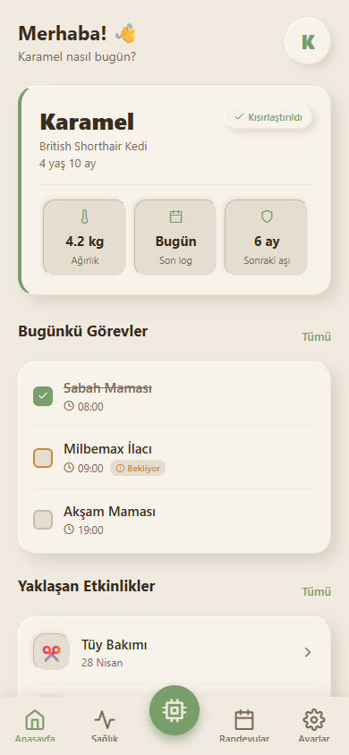
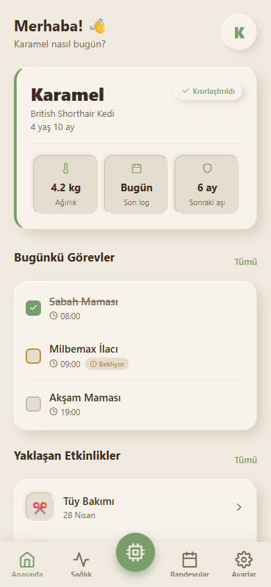

<div align="center">

# 🐾 Patika

**Evcil hayvanınızın sağlığını takip edin — akıllıca, sevgiyle.**

*A smart pet health tracking app built with React Native & AI*

[](https://expo.dev)
[](https://www.typescriptlang.org)
[](https://supabase.com)
[](https://anthropic.com)

</div>

---

## 📱 Ekranlar / Screenshots

<div align="center">

| Dashboard | Sağlık Günlüğü | AI Asistan |
|:---------:|:--------------:|:----------:|
|  |  |  |

| Randevular | Ayarlar | Hayvan Profili |
|:----------:|:-------:|:--------------:|
|  |  |  |

| Sağlık Kaydı Ekle | Randevu Ekle |
|:-----------------:|:------------:|
|  |  |

</div>

---

## ✨ Özellikler / Features

- 🏠 **Dashboard** — Günlük görevler, yaklaşan etkinlikler ve hızlı işlemler
- 📊 **Sağlık Günlüğü** — Ağırlık takibi, iştah & enerji grafiği, dışkı durumu
- 🤖 **AI Semptom Asistanı** — Claude AI ile semptom analizi ve aciliyet değerlendirmesi (NORMAL / DİKKAT / ACİL)
- 📅 **Randevular** — Veteriner, bakım, aşı randevularını organize et
- 🐱 **Hayvan Profili** — Temel bilgiler, sağlık durumu, aşı & ilaç takvimi
- ⚙️ **Ayarlar** — Bildirim tercihleri, hayvan yönetimi

---

## 🎨 Tasarım / Design

**Nature / Earthy Neumorphism** — Doğadan ilham alan sıcak tonlar:

| Renk | Kullanım |
|------|----------|
| `#F0EAE0` | Arka plan (kum) |
| `#7A9E6B` | Birincil (adaçayı yeşili) |
| `#3A2C1E` | Ana metin (sıcak kahve) |
| `#C68B3A` | Dikkat rengi (amber) |
| `#B84C30` | Acil rengi (terracotta) |

---

## 🛠 Tech Stack

| Katman | Teknoloji |
|--------|-----------|
| Frontend | React Native + Expo SDK 54 |
| Dil | TypeScript (strict) |
| State | Zustand + React Query |
| Backend | Supabase (PostgreSQL + Auth + Storage) |
| AI | Anthropic Claude API |
| Navigasyon | React Navigation (Bottom Tabs + Native Stack) |
| Grafikler | react-native-chart-kit |
| Bildirimler | expo-notifications |

---

## 🚀 Kurulum / Setup

### Gereksinimler
- Node.js 18+
- Expo CLI (`npm install -g expo-cli`)

### Adımlar

```bash
# Repoyu klonla
git clone https://github.com/eyupaltug3517/patika.git
cd patika

# Bağımlılıkları kur
npm install

# Ortam değişkenlerini ayarla
cp .env.example .env.local
# .env.local içine Supabase URL ve ANON KEY ekle

# Uygulamayı başlat
npx expo start

# Web için
npx expo start --web
```

### Ortam Değişkenleri

```env
EXPO_PUBLIC_SUPABASE_URL=https://xxxx.supabase.co
EXPO_PUBLIC_SUPABASE_ANON_KEY=your-anon-key
EXPO_PUBLIC_CLAUDE_API_KEY=your-claude-api-key
```

---

## 📁 Klasör Yapısı

```
patika/
├── src/
│   ├── core/
│   │   ├── config.ts              # Ortam değişkenleri
│   │   └── theme/
│   │       └── neu.ts             # Neumorphism tema sistemi
│   ├── data/
│   │   ├── models/                # TypeScript interface'leri
│   │   ├── repositories/          # Supabase CRUD
│   │   └── services/
│   │       ├── supabaseClient.ts
│   │       └── claudeService.ts
│   ├── presentation/
│   │   ├── screens/
│   │   │   ├── dashboard/
│   │   │   ├── healthLog/
│   │   │   ├── aiAssistant/
│   │   │   ├── appointments/
│   │   │   ├── petProfile/
│   │   │   └── settings/
│   │   ├── components/
│   │   └── navigation/
│   └── store/
│       ├── healthLogStore.ts       # Zustand sağlık log store
│       └── appointmentStore.ts    # Zustand randevu store
├── scripts/
│   └── take-screenshots.js        # Otomatik ekran görüntüsü
├── screenshots/                   # Ekran görüntüleri
├── supabase/                      # DB migration'ları
└── CLAUDE.md                      # Agent team kılavuzu
```

---

## 🗄 Veritabanı Şeması

```sql
users · pets · vaccinations · medications
health_logs · feeding_schedules · appointments
documents · ai_consultations
```

---

## 🤖 AI Asistan Kuralları

- Kesinlikle **teşhis koymaz**
- Aciliyet seviyesi: `NORMAL` / `DİKKAT` / `ACİL`
- Maks. 150 kelime yanıt
- Her zaman veterinere yönlendirir
- Ücretsiz plan: **5 sorgu/ay**
- Model: `claude-haiku-4-5` (maliyet optimizasyonu)

---

## 📋 Yol Haritası / Roadmap

- [x] Expo projesi + tema sistemi
- [x] Navigasyon yapısı (Bottom Tabs + Stack)
- [x] Dashboard ekranı
- [x] Sağlık günlüğü (form + grafik + liste)
- [x] AI Semptom Asistanı (mock)
- [x] Randevular (CRUD)
- [x] Hayvan profili
- [x] Ayarlar ekranı
- [ ] Supabase auth entegrasyonu
- [ ] Gerçek Claude API bağlantısı
- [ ] Push notification'lar
- [ ] Android APK (EAS Build)
- [ ] iOS TestFlight

---

## 👤 Geliştirici

**Eyüp Altuğ Tunç**
GitHub: [@eyupaltug3517](https://github.com/eyupaltug3517)

---

<div align="center">
Made with ❤️ for pets everywhere 🐾
</div>
